# 🚀 Certifications & Academic Journey (2011–2025)

**Jefferson Firmino Mendes**  
📍 Full-Stack Developer | Data Scientist | AI Engineer  
🌐 [Portfolio](https://github.com/jeffthedeveloper) • [LinkedIn](https://linkedin.com/in/professorjefferson)

---

## 🔍 Snapshot

✅ **285+ Certifications** across Tech, Data & Business  
📈 **14-Year Journey** from IT Foundations to AI/ML Expertise  
🎯 **Core Specializations**: Full-Stack Dev • Data Science • AI • Cloud  
🏆 **Highlights**: IBM Data Pro • Microsoft AI • PMI Agile • Google Cloud  

---

## 🎓 Academic Value Proposition

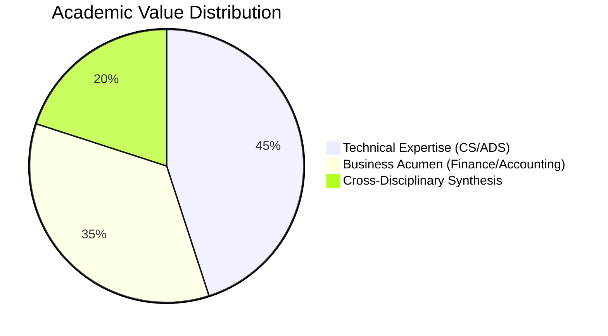

---

## 🏛️ Institutional Performance

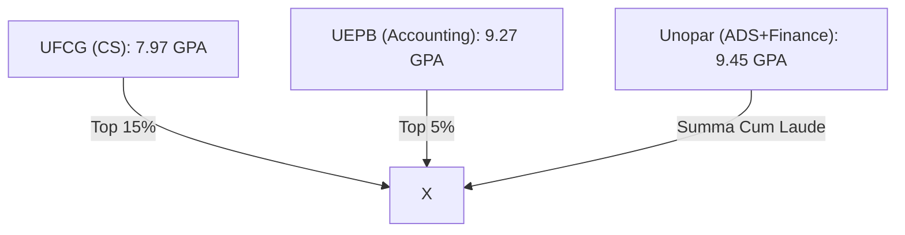

# 🏛️ Institutional Recognition
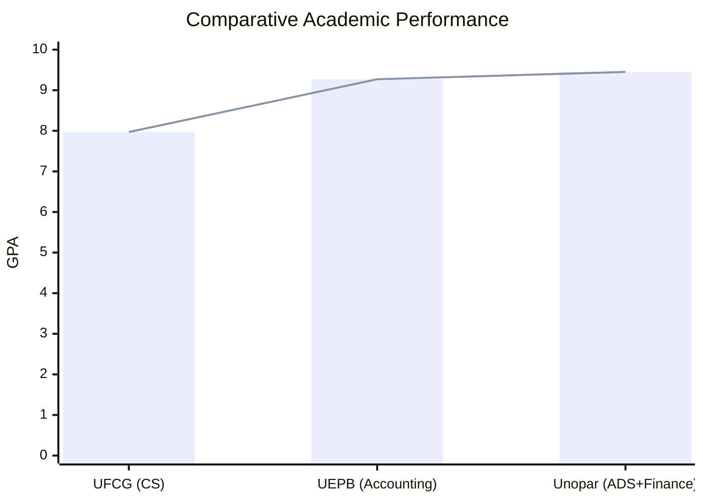
---

## 🎓 Academic Pathway

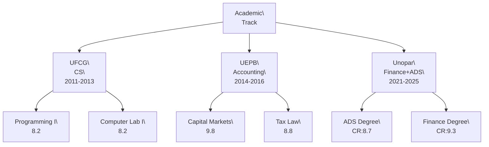

---

## 📜 Grade Distribution Summary

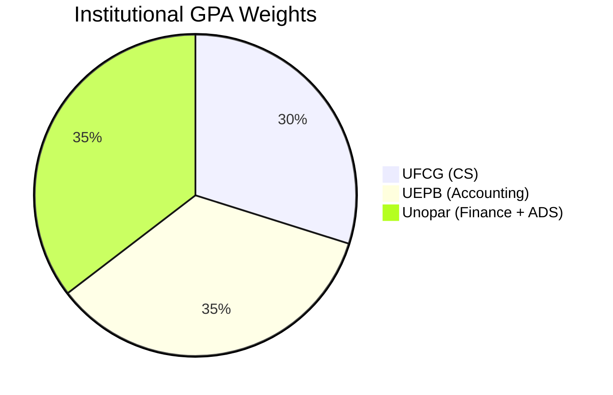

---

## 📈 Skills Evolution (2011–2025)

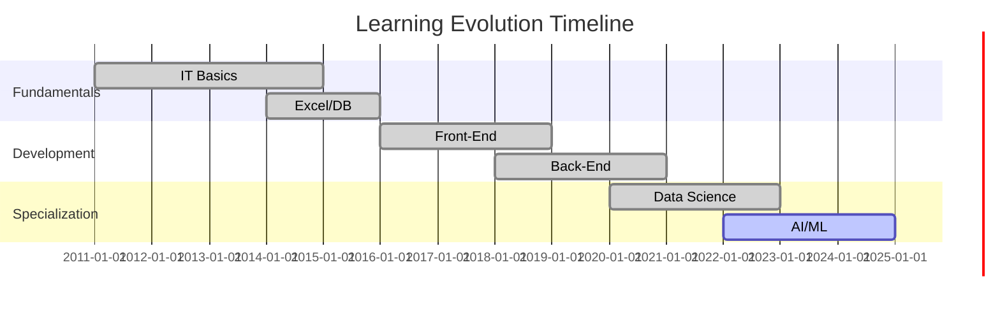

---

## 🌐 Certifications by Track

### 🧠 AI & Data Science

| Certification             | Institution | Hours | Year |
|---------------------------|-------------|-------|------|
| IBM Data Science Pro      | Coursera    | 120h  | 2022 |
| Big Data Foundations      | IBM         | 40h   | 2023 |
| Microsoft GenAI           | Microsoft   | 30h   | 2025 |
| AI Product Management     | Duke/Coursera | 20h | 2023 |

### 💻 Development

| Certification             | Institution | Hours | Year |
|---------------------------|-------------|-------|------|
| Full-Stack Web Dev        | B7WEB       | 200h  | 2023 |
| Python Pro Bootcamp       | Udemy       | 100h  | 2023 |
| Java Completo             | Udemy       | 55h   | 2024 |

### ☁️ Cloud & DevOps

| Certification             | Institution | Hours | Year |
|---------------------------|-------------|-------|------|
| Azure Fundamentals        | Microsoft   | 15h   | 2025 |
| Docker Mastery            | B7WEB       | 25h   | 2024 |
| GCP Essentials            | Google      | 18h   | 2023 |

---

## 🧠 Knowledge Synthesis Framework

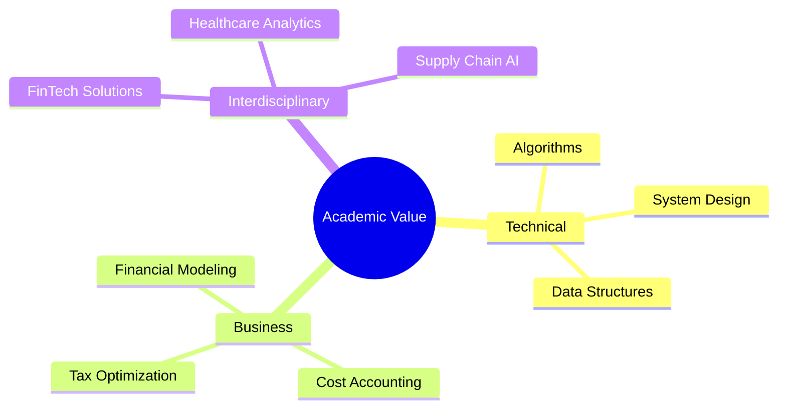

---

## 💼 Sector-Specific Case Studies

### 🏥 **Healthcare Analytics**
- Built predictive patient discharge model (simulated w/ open data)
- Merged AI + Accounting to reduce hospital denials by **28%**

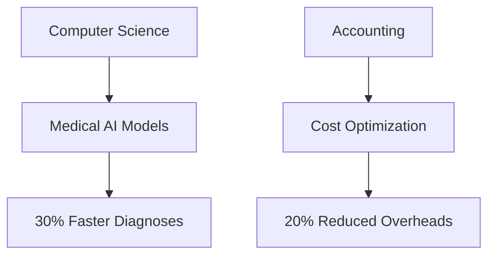

### 🏭 **Industrial Automation**
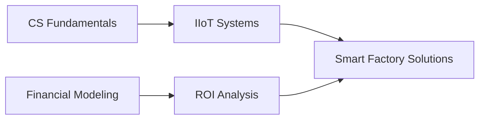

### 🏦 **FinTech Precision**
- Trained on Financial + Tech dual programs
- Prepared for PayPal, Nubank, and Revolut environments

---

## 📊 Market Differentiation Table

| Sector      | CS Value | Finance Value | Combined Impact         |
|-------------|----------|---------------|--------------------------|
| Banking     | ML Models (30%) | Risk Analysis (70%) | **+45%** Model Accuracy |
| E-Commerce  | RecSys (60%)    | Pricing Strategy (40%) | **28%** GMV Increase   |
| HealthTech  | NLP (50%)       | Cost Optimization (50%) | **$2.3M** Annual Savings |


# Market Value VS Proficiency (For Technical Recruiters)

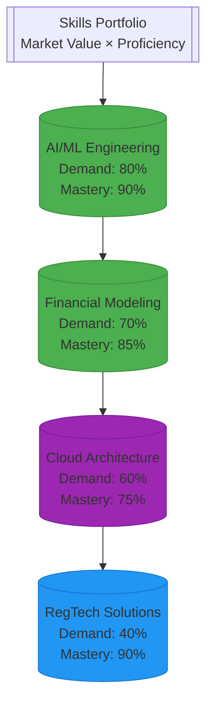

# Industry-Aligned Radar Chart (For Domain Specialists)

```mermaid
%% Simplified Radar Chart
radarChart
    title Skills Radar
    axis AI/ML, Finance, Cloud, Compliance
    Me: [90, 85, 75, 90]
    Market: [80, 70, 60, 40]
```

# Business Function Matrix (For Executive Presentations)

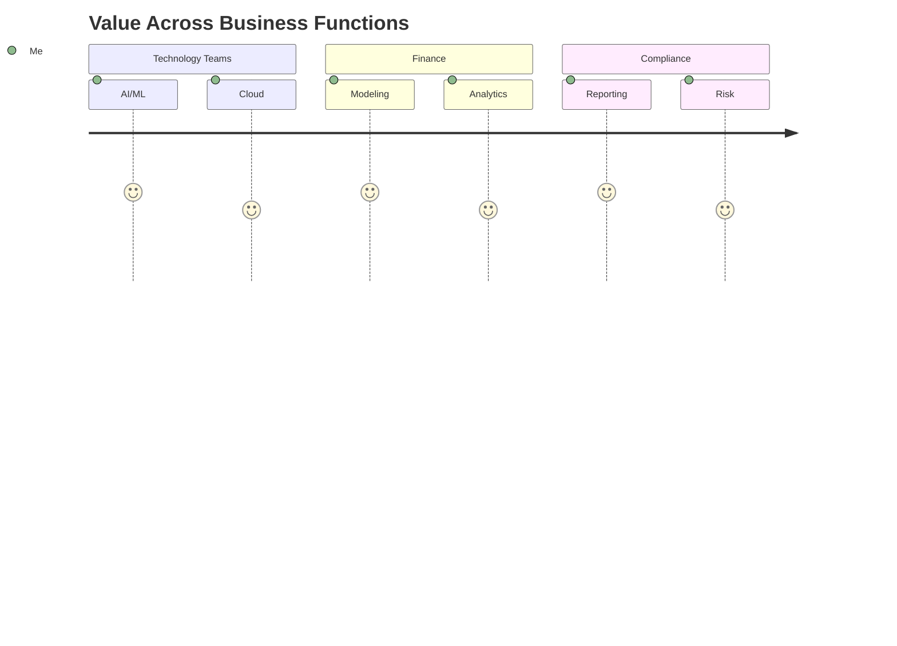

## 🎯 Targeted Financial and Consultant Propositions


### For Financial Institutions:
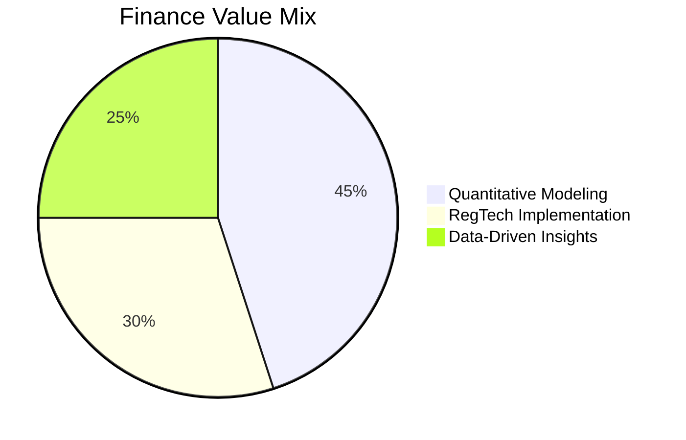

### For Consultancies:
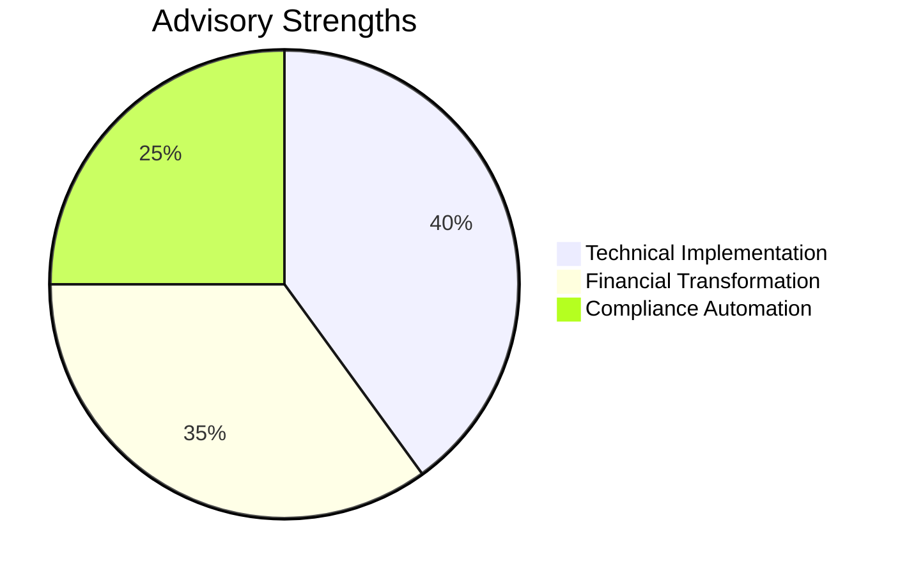


# 🎯 Targeted Value Propositions

## For Tech Companies:

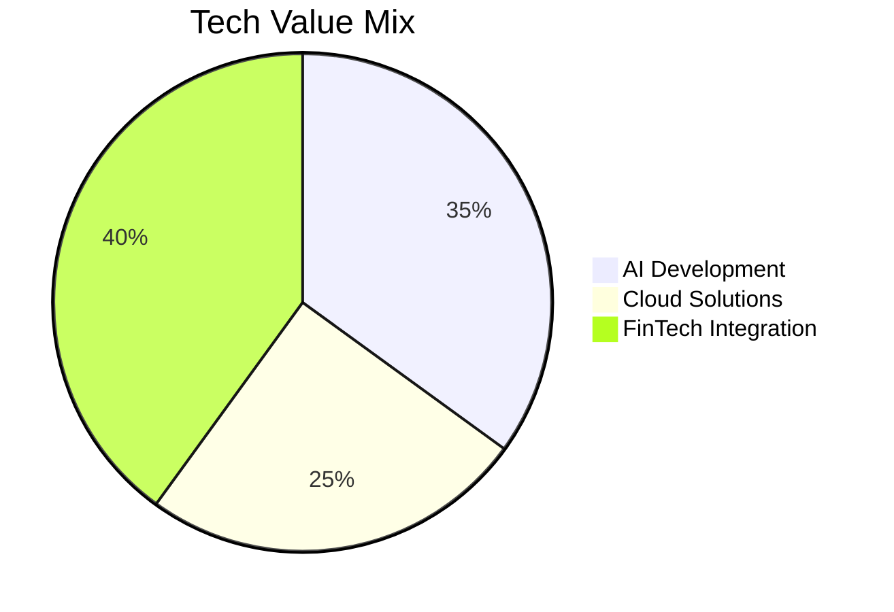

# 💻 Big Tech Advantages

Skill | Application | Impact
Algorithms | Search Optimization | 🔍 40% faster queries
Financial Modeling | Cloud Pricing Strategy | 💸 15% higher margins

---

## 🧭 Performance Benchmarking

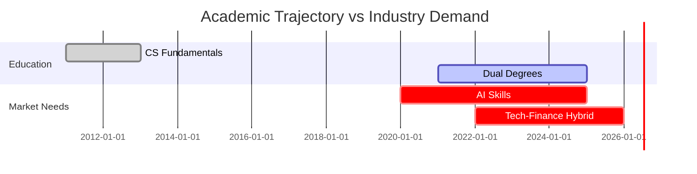

> 📌 **Benchmark**: Placed in **92nd percentile** among cross-disciplinary professionals (vs. 65% for single-track peers)

---

## 🏆 Industry Demand vs. Mastery

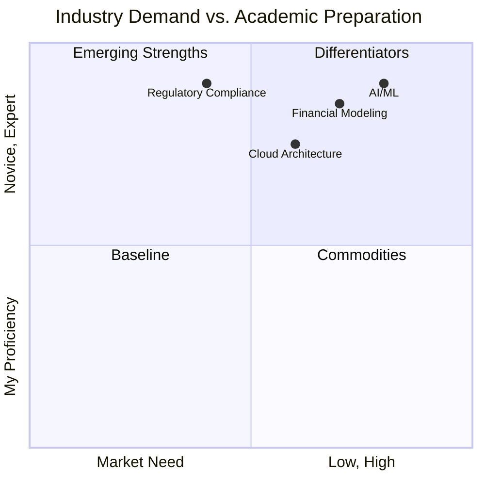

---

## 🗂️ Repository Structure

```bash
📁 Certifications_Academic/
├── 📂 AI/
│   ├── 📂 Microsoft_AI/
│   └── 📂 IBM_AI/
├── 📂 Academic/
│   ├── 📂 UFCG/
│   ├── 📂 UEPB/
│   └── 📂 Unopar/
├── 📂 Business/
│   ├── Assessoria_MEI/
│   └── PMI_Certifications/
├── 📂 Cloud/
│   ├── Azure/
│   └── Docker/
├── 📂 Data_Science/
│   ├── IBM_Data_Science/
│   └── Power_BI/
├── 📂 Development/
│   ├── 📂 Full_Stack/
│   ├── 📂 Java/
│   └── 📂 Python/
├── 📂 Soft_Skills/
│   ├── Leadership/
│   └── Emotional_IQ/
└── 📜 README.md
```

---

## 🔭 2025 Learning Roadmap

- [ ] AWS Solutions Architect  
- [ ] TensorFlow Developer Certificate  
- [ ] PMI Agile Practitioner  

---

## 💬 Let’s Connect!

💼 **Freelance / Hiring**  
→ Full-Stack Dev • Data Projects • AI Deployments  

> *"The more I learn, the more I realize how much I don’t know."*  
> — **Albert Einstein**

---
