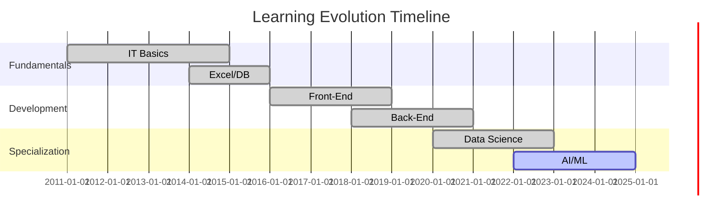
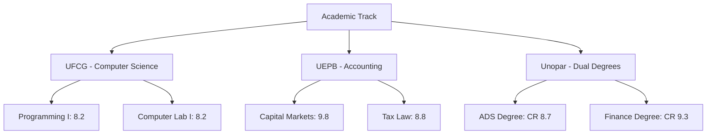
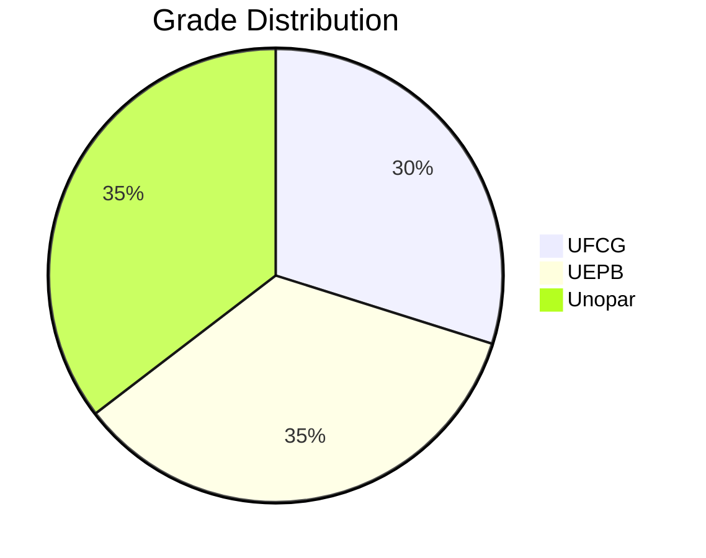

# 🚀 Certifications & Academic Journey (2011–2025)

**Jefferson Santos**  
📍 Full-Stack Developer | Data Scientist | AI Engineer  
🌐 [Portfolio](https://github.com/jeffthedeveloper) • [LinkedIn](https://linkedin.com/in/jeffthedeveloper)

---

## 🔍 Snapshot

✅ **285+ Certifications** across Tech, Data & Business  
📈 **14-Year Journey** from IT Foundations to AI/ML Expertise  
🎯 **Core Specializations**: Full-Stack Dev • Data Science • AI • Cloud  
🏆 **Highlights**: IBM Data Pro • Microsoft AI • PMI Agile • Google Cloud  

---

## 🌟 Top Certifications

### 🚀 Development  
| Certification | Institution | Hours | Year |
|--------------|-------------|-------|------|
| Full-Stack Web Dev | B7WEB | 200h | 2023 |
| Java Complete | Udemy | 55h | 2024 |
| Python Pro Bootcamp | Udemy | 100h | 2023 |

### 📊 Data & AI  
| Certification | Institution | Hours | Year |
|-----------------------|-------------|-------|------|
| IBM Data Science Pro  | Coursera    | 120h  | 2022 |
| GenAI Fundamentals    | Microsoft   | 30h   | 2025 |
| Big Data Foundations  | IBM         | 40h   | 2023 |

### ☁️ Cloud & DevOps  
| Certification       | Institution | Hours | Year |
|---------------------|-------------|-------|------|
| Docker Mastery      | B7WEB       | 25h   | 2024 |
| Azure Fundamentals  | Microsoft   | 15h   | 2025 |

---

## 📈 Skills Evolution (2011–2025)



---

## 🎓 Academic Pathway



---

## 📊 Academic Performance Summary



---

## 💼 Business Value Proposition

**For Tech Startups & Agencies**  
🔹 Full-cycle product development (front-end to DevOps)  
🔹 Scalable solutions using Python, Node.js, and React  
🔹 AI-ready architecture & cloud integrations  

**For Enterprises & Consulting**  
🔹 Process automation (30–50% efficiency gains)  
🔹 Data pipelines and visualization (Tableau, Power BI)  
🔹 Legacy modernization & cloud migration (Azure/GCP)

---

## 🗂️ Repository Structure

```
📁 Certifications_Academic/
├── 📂 AI/
│   ├── 📂 Microsoft_AI/
│   └── 📂 IBM_AI/
├── 📂 Academic/
│   ├── 📂 UFCG/
│   ├── 📂 UEPB/
│   └── 📂 Unopar/
├── 📂 Business/
│   ├── Assessoria_MEI/
│   └── PMI_Certifications/
├── 📂 Cloud/
│   ├── Azure/
│   └── Docker/
├── 📂 Data_Science/
│   ├── IBM_Data_Science/
│   └── Power_BI/
├── 📂 Development/
│   ├── 📂 Full_Stack/
│   ├── 📂 Java/
│   └── 📂 Python/
├── 📂 Soft_Skills/
│   ├── Leadership/
│   └── Emotional_IQ/
└── 📜 README.md
```
---

## 🧭 2025 Learning Roadmap

- [ ] AWS Solutions Architect  
- [ ] TensorFlow Developer Certificate  
- [ ] PMI Agile Practitioner  

---

## 📬 Let's Connect!

💼 **Freelance / Hiring**  
→ Full-Stack Dev • Data Projects • AI Deployments  
→ System Integration • Tech Training • App Refactoring  

📧 **Email**: professorjefferson.site@gmail.com 
🔗 **GitHub**: [github.com/jeffthedeveloper](https://github.com/jeffthedeveloper)

---

> _"Continuous learning is the minimum requirement for success in any field."_  
> — Brian Tracy

🗓️ *Last updated: April 2025*  

---

### 🌐 Version Control

🟢 English (Current)  
🇧🇷 [Versão em Português](#) _(em breve)_

